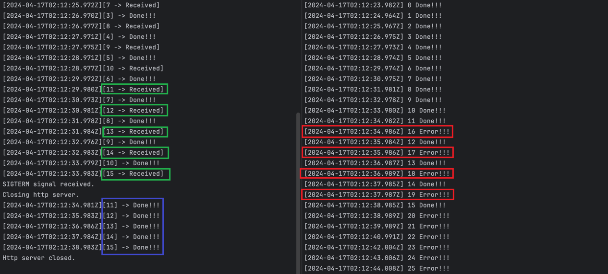

# Express-Graceful-Shutdown-Example

Show how to graceful shutdown a express process.

## Info

- **Client:** client.ts
- **Server:** www.ts

## Example
### 0. Install dependencies
```bash
❯ npm install
```


### 1. Start the server

```bash
❯ node ./src/www.ts   
Example app listening on port 3000!
```
- The server will listen on port 3000.
- And have a route '/test' that will take 5 seconds to respond.

And we can get the PID of the server process.
```bash
❯ lsof -i :3000
COMMAND   PID      USER   FD   TYPE             DEVICE SIZE/OFF NODE NAME
node    11897 weijialiu   22u  IPv6 0x61282cd6cda88888      0t0  TCP *:hbci (LISTEN)
```

Please note the PID of the server process. In this case, it is 11897.

### 2. Start the client

```bash
node ./src/client.ts
```

- The client will consistently make requests to the server. Every 1 second.
- The server will take 5 seconds to respond to each request.

When we start the client, we can see the logs:

```
❯ node ./src/client.ts
[2024-04-17T02:05:57.536Z] 0 Done!!!
[2024-04-17T02:05:58.503Z] 1 Done!!!
[2024-04-17T02:05:59.514Z] 2 Done!!!
[2024-04-17T02:06:00.508Z] 3 Done!!!
[2024-04-17T02:06:01.513Z] 4 Done!!!
[2024-04-17T02:06:02.512Z] 5 Done!!!
...
```

and the server logs:
```
Example app listening on port 3000!
[2024-04-17T02:05:52.510Z][0 -> Received]
[2024-04-17T02:05:53.499Z][1 -> Received]
[2024-04-17T02:05:54.501Z][2 -> Received]
[2024-04-17T02:05:55.504Z][3 -> Received]
[2024-04-17T02:05:56.507Z][4 -> Received]
[2024-04-17T02:05:57.509Z][5 -> Received]
[2024-04-17T02:05:57.511Z][0] -> Done!!!
[2024-04-17T02:05:58.499Z][1] -> Done!!!
[2024-04-17T02:05:58.509Z][6 -> Received]
[2024-04-17T02:05:59.502Z][2] -> Done!!!
[2024-04-17T02:05:59.516Z][7 -> Received]
[2024-04-17T02:06:00.505Z][3] -> Done!!!
[2024-04-17T02:06:00.519Z][8 -> Received]
[2024-04-17T02:06:01.509Z][4] -> Done!!!
[2024-04-17T02:06:01.520Z][9 -> Received]
[2024-04-17T02:06:02.509Z][5] -> Done!!!
[2024-04-17T02:06:02.523Z][10 -> Received]
...
```

### 3. Send a SIGTERM signal to the server process to gracefully shutdown

And we can send a SIGTERM signal to the server process to gracefully shutdown.

```bash
kill -SIGTERM 11897
```

And we can see the logs:



**Let's analyze the logs:**

The server received the SIGTERM signal and started the shutdown process.
```
SIGTERM signal received.
Closing http server.
```

In this case, the server has 5 requests in the queue. You can see that in server logs(Green box).
```
[2024-04-17T02:12:29.980Z][11 -> Received]
[2024-04-17T02:12:30.981Z][12 -> Received]
[2024-04-17T02:12:31.984Z][13 -> Received]
[2024-04-17T02:12:32.983Z][14 -> Received]
[2024-04-17T02:12:33.983Z][15 -> Received]

```

But the server will not accept any new requests. So you can see that the client will not receive any response after the server received the SIGTERM signal(Red box). They are all rejected by the server immediately.
```
[2024-04-17T02:12:34.986Z] 16 Error!!!
[2024-04-17T02:12:35.986Z] 17 Error!!!
[2024-04-17T02:12:36.989Z] 18 Error!!!
[2024-04-17T02:12:37.987Z] 19 Error!!!
[2024-04-17T02:12:38.989Z] 20 Error!!!
[2024-04-17T02:12:39.989Z] 21 Error!!!
[2024-04-17T02:12:40.991Z] 22 Error!!!
...
```

And the server will wait for 5 seconds to finish these requests. You can see that in the server logs(blue box).
```
[2024-04-17T02:12:34.981Z][11] -> Done!!!
[2024-04-17T02:12:35.983Z][12] -> Done!!!
[2024-04-17T02:12:36.986Z][13] -> Done!!!
[2024-04-17T02:12:37.984Z][14] -> Done!!!
[2024-04-17T02:12:38.983Z][15] -> Done!!!
```

After that, the server will close the server and exit the process.
```
Http server closed.
```

**Summary:**

- The server will not accept any new requests after receiving the SIGTERM signal.
- The server will wait for the requests in the queue to finish.
- The server will close the server and exit the process after all requests are finished.
- The client will not receive any response after the server received the SIGTERM signal.
